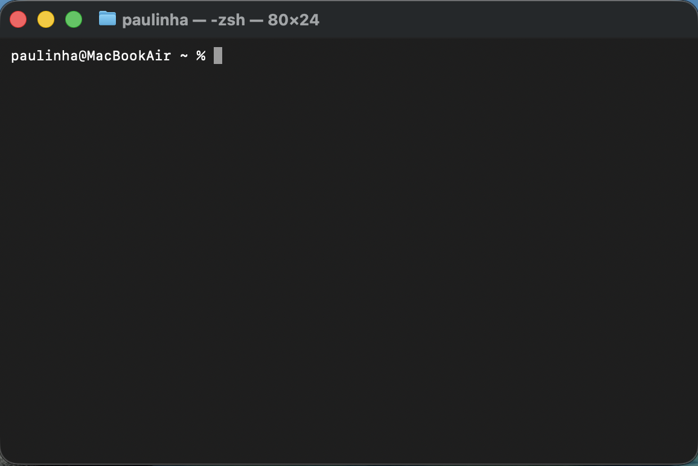
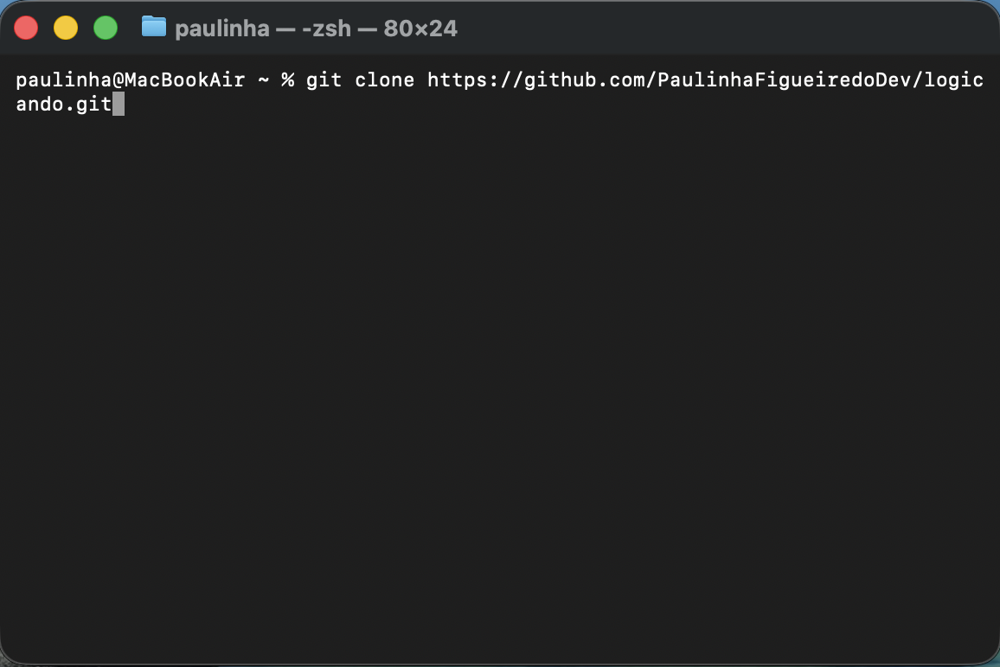
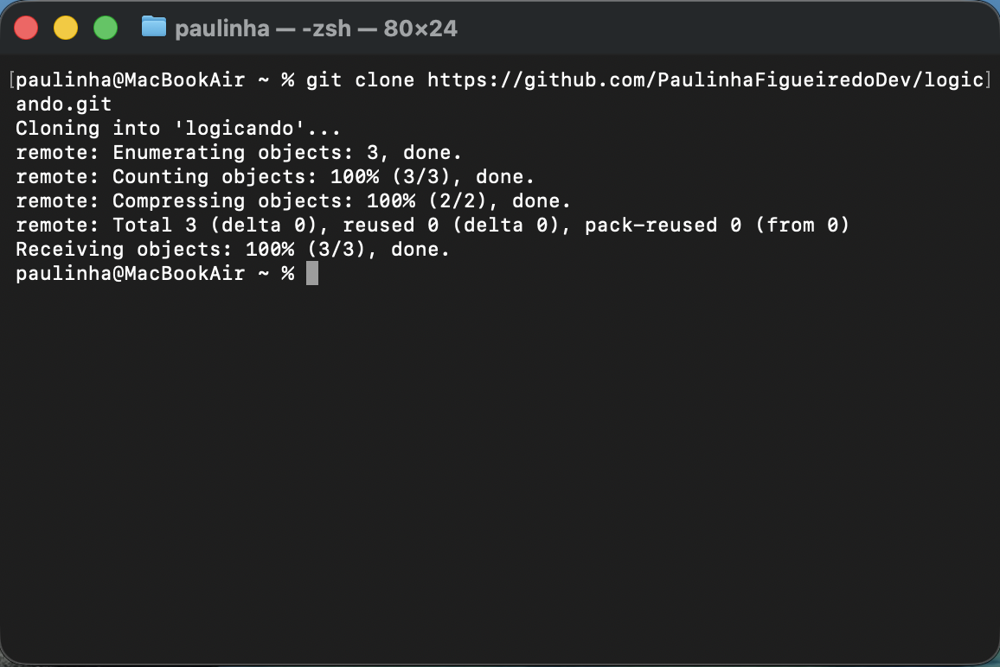
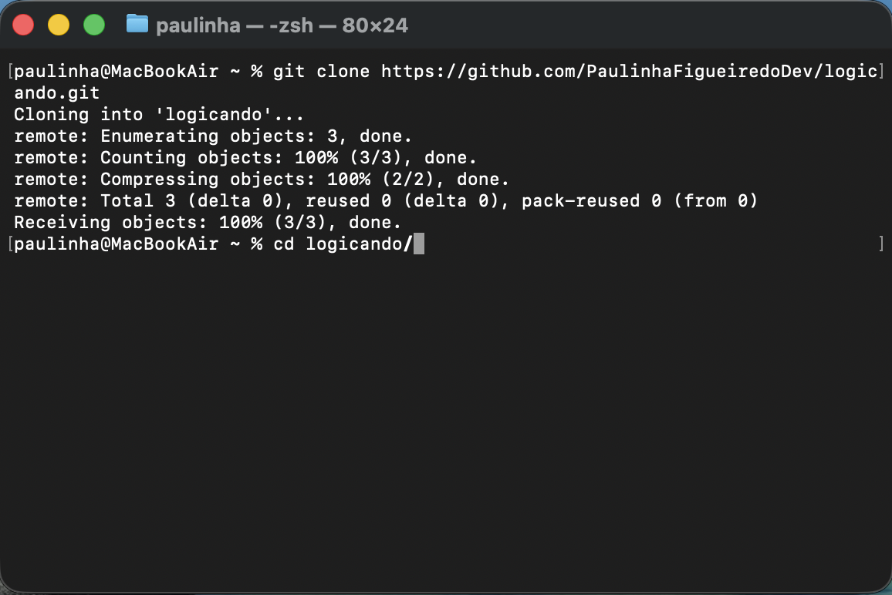
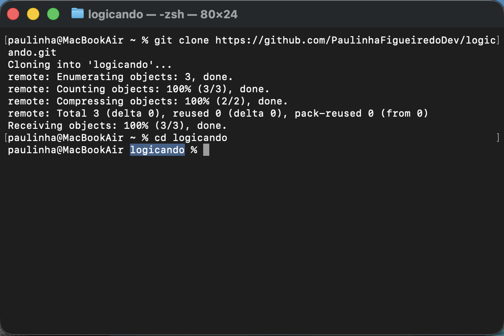

# Logicando

O Logicando é uma aplicação web simples e divertida para pessoas que estão começando a entender lógica de programação.

Na aplicação, a pessoa usuária pode interagir com uma tela e visualizar a lógica de programação acontecendo na prática.

## Índice

- [Como baixar e abrir o projeto](#como-baixar-e-abrir-o-projeto)
  - [Opção 1: abrir o arquivo HTML](#opção-1-abrir-o-arquivo-html)
  - [Opção 2: usar o Live Server](#opção-2-usar-o-live-server)
  - [Opção 3: visualizar pelo GitHub Pages](#opção-3-visualizar-pelo-github-pages)
- [Objetivo do projeto](#objetivo-do-projeto)
- [Tecnologias utilizadas](#tecnologias-utilizadas)

## Como baixar e abrir o projeto

Esta seção explica como baixar o Logicando do GitHub e entrar na pasta do projeto.

As imagens mostram o passo a passo usando o Terminal do macOS. Os comandos também funcionam em terminais do Linux. No Windows, você pode usar o PowerShell ou o Git Bash.

### Antes de começar

Você precisará de:

- uma conexão com a internet;
- o Git instalado no computador;
- um programa para abrir o terminal.

### Documentação sobre o terminal

Se você quiser entender melhor o terminal, consulte a documentação oficial do sistema operacional do seu computador:

- [Windows — comandos do Windows](https://learn.microsoft.com/pt-br/windows-server/administration/windows-commands/windows-commands);
- [macOS — Guia do Usuário do Terminal](https://support.apple.com/pt-br/guide/terminal/welcome/mac);
- [Linux/Ubuntu — linha de comando para iniciantes](https://documentation.ubuntu.com/desktop/en/latest/tutorial/the-linux-command-line-for-beginners/).

Em cada passo que tiver um comando, você pode digitá-lo no terminal ou copiar e colar o comando. Depois, pressione **Enter** ou **Return**.

### Passo 1: abrir o terminal

Abra o aplicativo Terminal no seu computador.

Quando ele estiver aberto, você verá uma linha esperando um comando.



### Passo 2: clonar o repositório

Clonar significa criar uma cópia do projeto do GitHub no seu computador.

Digite o comando abaixo no terminal ou copie e cole o comando no terminal:

```bash
git clone https://github.com/PaulinhaFigueiredoDev/logicando.git
```

Pressione **Enter** ou **Return**.



### Passo 3: aguardar o download

O Git fará o download dos arquivos. Não feche o terminal enquanto esse processo estiver acontecendo.

Quando a clonagem terminar, aparecerá uma mensagem parecida com `Receiving objects: 100%` e o terminal voltará a mostrar uma linha pronta para receber outro comando.



Se aparecer uma mensagem de erro, pare neste passo. Se precisar de ajuda, copie a mensagem completa do erro e pesquise no Google ou peça ajuda a um agente de IA. Não é necessário continuar enquanto o erro não for entendido e resolvido.

### Passo 4: entrar na pasta do projeto

Agora, digite o comando abaixo no terminal ou copie e cole o comando no terminal:

```bash
cd logicando
```

`cd` significa “change directory”, que em português significa “mudar de pasta”. Esse comando faz o terminal entrar na pasta chamada `logicando`, que é a pasta do projeto que você acabou de baixar.



### Passo 5: confirmar que você está na pasta correta

Depois de pressionar **Enter**, o nome `logicando` aparecerá na linha do terminal.

Isso indica que você está dentro da pasta do projeto.



Neste ponto, o projeto já foi baixado e você está no local correto para continuar.

## Como abrir a aplicação

O projeto foi criado com HTML, CSS e JavaScript básico. Você pode abrir a aplicação de duas formas:

### Opção 1: abrir o arquivo HTML

1. Abra a pasta `logicando` no gerenciador de arquivos do computador.
2. Dentro da pasta, localize o arquivo chamado `index.html`.
3. Clique duas vezes no arquivo `index.html`.
4. O navegador abrirá a aplicação. Se o computador perguntar qual programa deve ser usado, escolha um navegador, como Chrome, Edge, Firefox ou Safari.

### Opção 2: usar o Live Server

O Live Server é uma extensão do Visual Studio Code. Ele abre a aplicação em um endereço local e atualiza a página automaticamente quando os arquivos são alterados.

Para usar esta opção, você precisa ter o [Visual Studio Code](https://code.visualstudio.com/) instalado.

1. Abra o Visual Studio Code.
2. No menu superior, clique em **File > Open Folder**. Se o VS Code estiver em português, clique em **Arquivo > Abrir Pasta**.
3. Selecione a pasta `logicando` e clique em **Open** ou **Abrir**.
4. No lado esquerdo do VS Code, localize a barra vertical de ícones. Conte os ícones de cima para baixo e clique no quinto ícone, chamado **Extensões**. Se preferir usar o teclado, pressione **Ctrl + Shift + X** (Windows/Linux) ou **Cmd + Shift + X** (macOS).
5. Na caixa de pesquisa, digite `Live Server`.
6. Encontre a extensão **Live Server**, de autoria de **Ritwick Dey**, e clique em **Install** ou **Instalar**.
7. No lado esquerdo do VS Code, clique no primeiro ícone da barra vertical, chamado **Explorer**.
8. Na lista de arquivos, localize o arquivo chamado `index.html` e clique nele uma vez para abri-lo.
9. Dentro do arquivo aberto, clique com o botão direito do mouse.
10. Selecione **Open with Live Server**.
11. O navegador abrirá um endereço parecido com:

```text
http://127.0.0.1:5500
```

Para encerrar o Live Server, volte ao VS Code e clique em **Port: 5500** na barra inferior. Em seguida, escolha **Stop Live Server**. Se essa opção não aparecer, feche o VS Code.

### Opção 3: visualizar pelo GitHub Pages

O GitHub Pages permite abrir a aplicação diretamente no navegador, sem instalar o projeto no computador e sem usar o Live Server.

Para visualizar a aplicação:

1. Abra o navegador de internet.
2. Acesse o endereço:

```text
https://paulinhafigueiredodev.github.io/logicando/
```

3. A aplicação é carregada na tela.
4. Interaja com os elementos da página para visualizar a lógica de programação acontecendo.

Se o endereço não abrir, verifique se o GitHub Pages está ativado no repositório em **Settings > Pages** e se a publicação foi feita a partir da branch `main` e da pasta raiz (`/`).

Consulte a [documentação oficial do GitHub Pages](https://docs.github.com/pt/pages/getting-started-with-github-pages/configuring-a-publishing-source-for-your-github-pages-site) para saber como configurar a publicação.

## Objetivo do projeto

O objetivo do projeto é criar uma experiência clara e acolhedora na qual a pessoa usuária possa interagir com a tela e visualizar, passo a passo, como a lógica de programação acontece. A aplicação usará interações simples e exemplos visuais para facilitar o entendimento.

## Tecnologias utilizadas

- HTML semântico;
- CSS;
- JavaScript básico.
